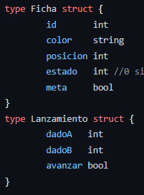

# Programación Concurrente y Distribuida

## TA3

### Integrantes:
- Jefferson Espinal Atencia (u201919607)
- Erick Aronés Garcilazo (u201924440)
- Ronaldo Cornejo Valencia (u201816502)

### Docente: 
Carlos Alberto Jara García

### Sección: CC65

### Ciclo: 2023-02

## Planteamiento del problema
El objetivo principal del trabajo es simular el juego de Ludo utilizando programación concurrente y canales para la comunicación entre jugadores y el tablero. Ludo es un juego en el que los jugadores compiten para guiar a sus personajes hasta la meta, a través de un laberinto lleno de obstáculos. 
La simulación debe ser capaz de manejar un grupo de jugadores de manera concurrente, lo que implica gestionar múltiples canales de comunicación y asegurar la justa sincronización de los turnos.
La simulación debe mostrar el progreso del juego en tiempo real, lo que significa que los jugadores deben recibir actualizaciones sobre el estado del juego y poder enviar sus movimientos de manera eficiente a través de los canales.

## Explicación del código y el uso de los mecanismos de paralelización y sincronización utilizados. 
Se definen dos estructuras: "Ficha" y "Lanzamiento". La estructura "Ficha" representa las fichas de los jugadores, y "Lanzamiento" representa los resultados de lanzar dos dados. Uno de los datos más importantes es “estado” de la estructura “Ficha” que podemos saber si una ficha se va entrar en una casilla donde hay obstáculo (1) o si ya estuvo en zona obstáculo (2).

## Explicación de las pruebas realizadas y pegar las imágenes de evidencia. 

## Enlace de github donde subió su código fuente y se pueda descargar 
[https://github.com/ekarones/TA3_PROGRAMACION_CONCURRENTE_DISTRIBUIDA/tree/main](https://github.com/ekarones/TA3_PROGRAMACION_CONCURRENTE_DISTRIBUIDA/tree/main)

## Enlace de vídeo presentando el funcionamiento de la aplicación 

