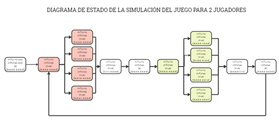

# Programación Concurrente y Distribuida

## TA3

### Integrantes:
- Jefferson Espinal Atencia (u201919607)
- Erick Aronés Garcilazo (u201924440)
- Ronaldo Cornejo Valencia (u201816502)

### Docente: 
Carlos Alberto Jara García

### Sección: CC65

### Ciclo: 2023-02

## Planteamiento del problema
El objetivo principal del trabajo es simular el juego de Ludo utilizando programación concurrente y canales para la comunicación entre jugadores y el tablero. Ludo es un juego en el que los jugadores compiten para guiar a sus personajes hasta la meta, a través de un laberinto lleno de obstáculos. 
La simulación debe ser capaz de manejar un grupo de jugadores de manera concurrente, lo que implica gestionar múltiples canales de comunicación y asegurar la justa sincronización de los turnos.
La simulación debe mostrar el progreso del juego en tiempo real, lo que significa que los jugadores deben recibir actualizaciones sobre el estado del juego y poder enviar sus movimientos de manera eficiente a través de los canales.

## Explicación del código y el uso de los mecanismos de paralelización y sincronización utilizados. 
Se definen dos estructuras: "Ficha" y "Lanzamiento". La estructura "Ficha" representa las fichas de los jugadores, y "Lanzamiento" representa los resultados de lanzar dos dados. Uno de los datos más importantes es “estado” de la estructura “Ficha” que podemos saber si una ficha se va entrar en una casilla donde hay obstáculo (1) o si ya estuvo en zona obstáculo (2).

```go
type Ficha struct {
	id       int
	color    string
	posicion int
	estado   int
	meta     bool
}
type Lanzamiento struct {
	dadoA   int
	dadoB   int
	avanzar bool
}
```

La función "loadGame" inicializa el juego, colocando obstáculos en el tablero y creando fichas para los jugadores.

```go
func loadGame(fichas *[]Ficha, tabla *[40]int, nPlayers int, colors []string, positions []int) {
	var contador int

	for contador < MAXOBSTACULOS {
		number := rand.Intn(40)
		found := false
		for _, v := range positions {
			if number == v {
				found = true
				break
			}
		}
		if !found {
			contador++
			(*tabla)[number] = -1
		}

	}

	for i := 0; i < nPlayers; i++ {
		for j := 0; j < NFICHAS; j++ {
			ficha := Ficha{
				id:       j + 1,
				color:    colors[i],
				posicion: positions[i],
				meta:     false,
			}
			*fichas = append(*fichas, ficha)
		}
	}
}
```

La función "lanzarDados" genera un lanzamiento de dados aleatorio y devuelve un objeto de tipo "Lanzamiento".

```go
func lanzarDados() Lanzamiento {
	valor := rand.Intn(2)
	tiro := Lanzamiento{
		dadoA:   rand.Intn(6) + 1,
		dadoB:   rand.Intn(6) + 1,
		avanzar: valor == 1,
	}
	return tiro
}
```

La función "pierdeTurno" verifica si un jugador pierde su turno debido a un obstáculo en el tablero.

```go
func pierdeTurno(tabla [40]int, fichas *[]Ficha, n int) bool {

	for i := 0; i < 4; i++ {
		for ind, valor := range tabla {
			if valor == -1 && ind == (*fichas)[i+n].posicion {
				(*fichas)[i+n].estado += 1
				if (*fichas)[i+n].estado > 2 {
					(*fichas)[i+n].estado = 2
				}
			}
			if (*fichas)[i+n].estado == 2 && valor == 0 && ind == (*fichas)[i+n].posicion {
				(*fichas)[i+n].estado = 0
			}
		}
	}

	for i := 0; i < 4; i++ {
		if (*fichas)[i+n].estado == 1 {
			return true
		}
	}
	return false
}
```

La función "turnoJugador" representa el turno de un jugador. Utiliza canales para coordinar los movimientos de las fichas y realiza cálculos para avanzar las fichas en función de los resultados de los dados. También verifica si un jugador ha llegado a la meta y gana el juego.	

```go
func turnoJugador(color string, wg *sync.WaitGroup, miTurno chan bool, ficha1 chan bool, ficha2 chan bool, ficha3 chan bool, ficha4 chan bool, fichas *[]Ficha, tabla [40]int) {
	defer wg.Done()
	var finJuego bool
	var ind int
	var n int

	if color == "red" {
		n = 0
	}
	if color == "green" {
		n = 4
	}
	if color == "blue" {
		n = 8
	}
	if color == "yellow" {
		n = 12
	}

	for !finJuego {
		time.Sleep(time.Millisecond * 100)
		miTurno <- true
		fmt.Printf("TURNO JUGADOR %s \n", color)
		if !pierdeTurno(tabla, *&fichas, n) {
			fmt.Println("JUGANDO...")
			var tiro Lanzamiento = lanzarDados()
			go func() {
				if (*fichas)[n].meta == false && (*fichas)[n].posicion != 39 {
					ficha1 <- true
				}
			}()
			go func() {
				if (*fichas)[n+1].meta == false && (*fichas)[n+1].posicion != 39 {
					ficha2 <- true
				}
			}()
			go func() {
				if (*fichas)[n+2].meta == false && (*fichas)[n+2].posicion != 39 {
					ficha3 <- true
				}
			}()
			go func() {
				if (*fichas)[n+3].meta == false && (*fichas)[n+2].posicion != 39 {
					ficha4 <- true
				}
			}()

			select {
			case <-ficha1:
				fmt.Printf("(JUEGA FICHA 1)\n")
				ind = n

			case <-ficha2:
				fmt.Printf("(JUEGA FICHA 2)\n")
				ind = n + 1

			case <-ficha3:
				fmt.Printf("(JUEGA FICHA 3)\n")
				ind = n + 2

			case <-ficha4:
				fmt.Printf("(JUEGA FICHA 4)\n")
				ind = n + 3
			}

			go func() {
				for {
					select {
					case <-ficha1:
					case <-ficha2:
					case <-ficha3:
					case <-ficha4:
					default:
						// El canal está vacío
						return
					}
				}
			}()

			if tiro.avanzar {
				fmt.Println("RESULTADO LANZAMIENTO: ", tiro.dadoA+tiro.dadoB)
				(*fichas)[ind].posicion += tiro.dadoA + tiro.dadoB
				if (*fichas)[ind].posicion > 39 {
					(*fichas)[ind].posicion = 39 - ((*fichas)[ind].posicion - 39)
				}
			} else {
				fmt.Println("RESULTADO LANZAMIENTO: ", tiro.dadoA-tiro.dadoB)
				(*fichas)[ind].posicion += tiro.dadoA - tiro.dadoB
				if (*fichas)[ind].posicion < 0 {
					(*fichas)[ind].posicion = 0
				}
			}
			fmt.Println("POSCION ACTUAL DE LA FICHA: ", (*fichas)[ind].posicion)

			for i := n; i < n+4; i++ {
				if (*fichas)[ind].posicion == 39 {
					(*fichas)[ind].meta = true
				}
			}
			fichasCompletadas := 0
			for _, f := range (*fichas)[n : n+4] {
				if f.meta == true {
					fichasCompletadas++
				}
			}

			if fichasCompletadas == 4 {
				fmt.Println("***ACABA DE GANAR EL COLOR: ", color)
				finJuego = true
			}

		} else {
			fmt.Println("ESTE JUGADOR PERDIO SU TURNO")
		}
		fmt.Println("------------------------")

		select {
		case <-miTurno:
		default:
		}
	}
}
```

En la función principal, se crea un tablero, después se solicita el número de jugadores y se carga el juego. Luego, se inician goroutines para los turnos de los jugadores. Se utiliza un canal "miTurno" para coordinar cuándo cada jugador puede tomar su turno. La función principal espera a que todos los jugadores terminen su juego y luego imprime los resultados.

```go
func main() {
	var wg sync.WaitGroup
	var tabla [40]int

	fichas := []Ficha{}
	colors := []string{"red", "green", "blue", "yellow"}
	positions := []int{0, 0, 0, 0, 39}

	var nPlayers int

	getNumberPlayers(&nPlayers)
	loadGame(&fichas, &tabla, nPlayers, colors, positions)
	fmt.Println(tabla)

	miTurno := make(chan bool, 1)
	chFichas := make([]chan bool, nPlayers*NFICHAS)

	for i := range chFichas {
		chFichas[i] = make(chan bool)
	}

	for ind, c := range colors[:nPlayers] {
		wg.Add(1)
		go turnoJugador(c, &wg, miTurno, chFichas[ind*NFICHAS], chFichas[ind*NFICHAS+1], chFichas[ind*NFICHAS+2], chFichas[ind*NFICHAS+3], &fichas, tabla)
	}

	wg.Wait()
	close(miTurno)

	fmt.Println("!!!JUEGO FINALIZADO TODOS LOS JUGADORES LLEGARON A LA META !!!")
	for _, v := range fichas {
		fmt.Println(v)
	}

}
```
## Uso de Mecanismos de Paralelización y Sincronización:
- Canales (miTurno, ficha1, ficha2, ficha3, ficha4): Los canales se utilizan para coordinar los turnos y las acciones de los jugadores. En particular, miTurno se utiliza para indicar cuándo un jugador puede tomar su turno, mientras que los canales ficha1, ficha2, ficha3 y ficha4 se utilizan para permitir que sea elegida una ficha para jugar durante el turno. Cuando un jugador quiere tomar su turno, envía un valor al canal miTurno, lo que indica que está listo para jugar. Otros jugadores esperan a que sea su turno, bloqueándose en <-miTurno hasta que el canal se active.
- Goroutines: El código utiliza goroutines para representar a los jugadores y a las fichas al momento de ser elegidas para jugar. Cada jugador se ejecuta en su propia goroutine y se coordina con los canales para jugar su turno y avanzar sus fichas.
- Espera de Grupo (sync.WaitGroup): Se crea una espera de grupo (sync.WaitGroup) llamada wg para coordinar la ejecución de las goroutines de los jugadores. Antes de iniciar una goroutine de jugador, se llama a wg.Add(1) para agregar una tarea al grupo, y cuando un jugador ha terminado su turno, se llama a wg.Done() para indicar que la tarea ha sido completada. En la función main, se utiliza wg.Wait() para esperar a que todas las goroutines de los jugadores terminen antes de continuar.

## Explicación de las pruebas realizadas y pegar las imágenes de evidencia. 


## Enlace de github donde subió su código fuente y se pueda descargar 
[https://github.com/ekarones/TA3_PROGRAMACION_CONCURRENTE_DISTRIBUIDA/tree/main](https://github.com/ekarones/TA3_PROGRAMACION_CONCURRENTE_DISTRIBUIDA/tree/main)

## Enlace de vídeo presentando el funcionamiento de la aplicación 
[https://youtu.be/msRSt75hk3I](https://youtu.be/msRSt75hk3I)


